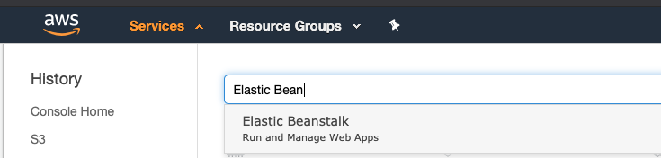

# Putting it all together

At this point, you already completed the following tasks:

* Created a new repository in DockerHub to store our container images
* Created a new Environment and Sample Docker application in AWS Elastic Beanstalk
* Configured your GitHub repository in CircleCI and added the CircleCI configuration to you project

So, we are almost done, but still needs some configuration tweaks to end up with our CI/CD pipeline.


Let's start by taking a look into what our CircleCI script is doing:

```text
version: 2
jobs:

  yarn:
    docker:
      # specify the version you desire here
      - image: circleci/node:10.10.0-stretch-browsers-legacy

    working_directory: ~/repo

    steps:
      - checkout
      # Download and cache dependencies
      - restore_cache:
          keys:
          - yarn-cache-{{ checksum "yarn.lock" }}
      - run: yarn install
      - save_cache:
          paths:
            - node_modules
          key: yarn-cache-{{ checksum "yarn.lock" }}
      - persist_to_workspace:
          root: .
          paths:
            - node_modules

  lint:
    docker:
      - image: circleci/node:10.10.0-stretch-browsers-legacy
    working_directory: ~/repo
    steps:
      - checkout
      - attach_workspace:
          at: ~/repo
      - run:
          name: Linting
          command: yarn lint

  unit-tests:
    docker:
      - image: circleci/node:10.10.0-stretch-browsers-legacy
    working_directory: ~/repo
    steps:
      - checkout
      - attach_workspace:
          at: ~/repo
      - run:
          name: Unit Tests
          command: yarn test:unit

  build:
    docker:
      - image: circleci/node:10.10.0-stretch-browsers-legacy
    working_directory: ~/repo
    steps:
      - checkout
      - attach_workspace:
          at: ~/repo
      - run:
          name: Build
          command: yarn build:tsoa
      - persist_to_workspace:
          root: .
          paths:
            # This path can be used by other jobs
            - build
```

This section will be changing for different technologies, but the steps ideas will remain the same, is where you specify you package manager, in this case we are using yarn, then you specify the different jobs to make the CircleCI service run the lint check, unit tests and the actual build. But then we need to define the deployment steps:

```text
deploy-dev:
    machine: true
    steps:
      - checkout
      - run:
          name: Build and push Docker image to development
          command: |
            docker build -t nextonlabs/team-talent-tool-api:dev .
            docker login -u $DOCKER_NEXTON_USER -p $DOCKER_NEXTON_PASS
            docker push nextonlabs/team-talent-tool-api:dev
            apt-get update && apt-get install -y awscli
            /bin/bash scripts/EB-deploy.dev.sh $CIRCLE_SHA1
```

In this configuration, the following is happening:

1 - Creating a container image for our app, and tagging it with the dev tag

```text
docker build -t nextonlabs/team-talent-tool-api:dev .
```

2 - Logging into DockerHub using the environment variables DOCKER\_NEXTON\_USER and DOCKER\_NEXTON\_PASS that needs to be created into the CircleCI project settings

```text
docker login -u $DOCKER_NEXTON_USER -p $DOCKER_NEXTON_PASS
```


3 - Uploads the container image to DockerHub

```text
docker push nextonlabs/team-talent-tool-api:dev
```

4 - Installs the AWS CLI to notify AWS EBS that a new image is available in DockerHub

```text
apt-get update && apt-get install -y awscli
```

5 - Runs an script to send the new image to AWS EBS for deployment

```text
/bin/bash scripts/EB-deploy.dev.sh $CIRCLE_SHA1
```

Find below and example of the EB-deploy file

```text
#!/usr/bin/env bash

SHA1=$1
EB_BUCKET=elasticbeanstalk-us-east-1-424423231904
DOCKERRUN_FILE=$SHA1-Dockerrun.dev.aws.json

# Create prod Elastic Beanstalk version
sed "s/<TAG>/$SHA1/" < Dockerrun.dev.aws.json > $DOCKERRUN_FILE
aws s3 cp $DOCKERRUN_FILE s3://$EB_BUCKET/$DOCKERRUN_FILE --region us-east-1
aws elasticbeanstalk create-application-version --application-name NextonLabs \
  --version-label $SHA1 --source-bundle S3Bucket=$EB_BUCKET,S3Key=$DOCKERRUN_FILE --region us-east-1

# Update Elastic Beanstalk environment to prod version
aws elasticbeanstalk update-environment --environment-name team-talent-tool-api-dev \
    --version-label $SHA1 --region us-east-1 --description 'from team-talent-tool-api-dev'
```

This file is using an EB\_BUCKET, that is an S3 bucket that is being created automatically by EBS when you create your first environment. Is a bucket that is being used to store EBS configuration. If you have several EBS environments and applications, is ok to use the same EB\_BUCKET.

AWS EBS will need to have access to your DockerHub container image to be able to pick it up and deploy it. So, to do that, it needs to have a config file stored in the previous mentioned bucket. Is the docker config.json file, to create it do the following:

In order to create it, you need to run the following command: 

`docker login`

This command will create the file in `/Users/{your_user}/.docker/config.json`


In case your file has not an auth entry, because the authentication is using the keychain credentials store, we have to change it since AWS [EBS](https://aws.amazon.com/es/elasticbeanstalk/) won’t have that storage. Since it is quite tricky to get that credentials… do the following....

Open your `~/.docker/config.json` and remove the "credsStore": "oskeychain" entry. This will cause credentials to be written to the config.json directly after login again into docker. After you have the config file, upload it to the S3 EBS bucket.

One last thing you will need to consider is to create a new AWS IAM user to be used by CircleCI. This user should have access to S3 and EBS, you can create a deployers group and add it to it.



When you have your user created, you will need to generate an Access key to be used by CircleCI to communicate with AWS. You can generate that going to Security credentials tab. Then just add them to your CircleCI project.

When the continuos deployment setup is ready, we still need to add some configuration to our AWS EBS environment. To do that, you need to go to the EBS application and click on configuration.


In this section, you can configure several things, like if you app will have a load balancer in front or it will be a single node application, add environment variables, security, monitoring, etc. But we will be focused on how our sample application will connect to the created RDS DB. 

What we usually do, is to pass the DB configuration parameters as environment variables to our application to don't need to commit sensible data to git repositories. So, this configuration will be stored just in AWS. 

To add those env variables to our EBS application, go to Software configuration, and add the variables you are using in the app. 


When you are done, click on apply. This will restart the docker container and attach to it the newly created environment variables.

